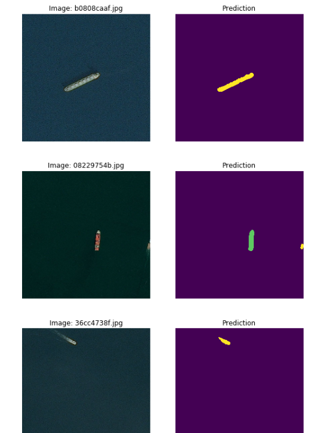
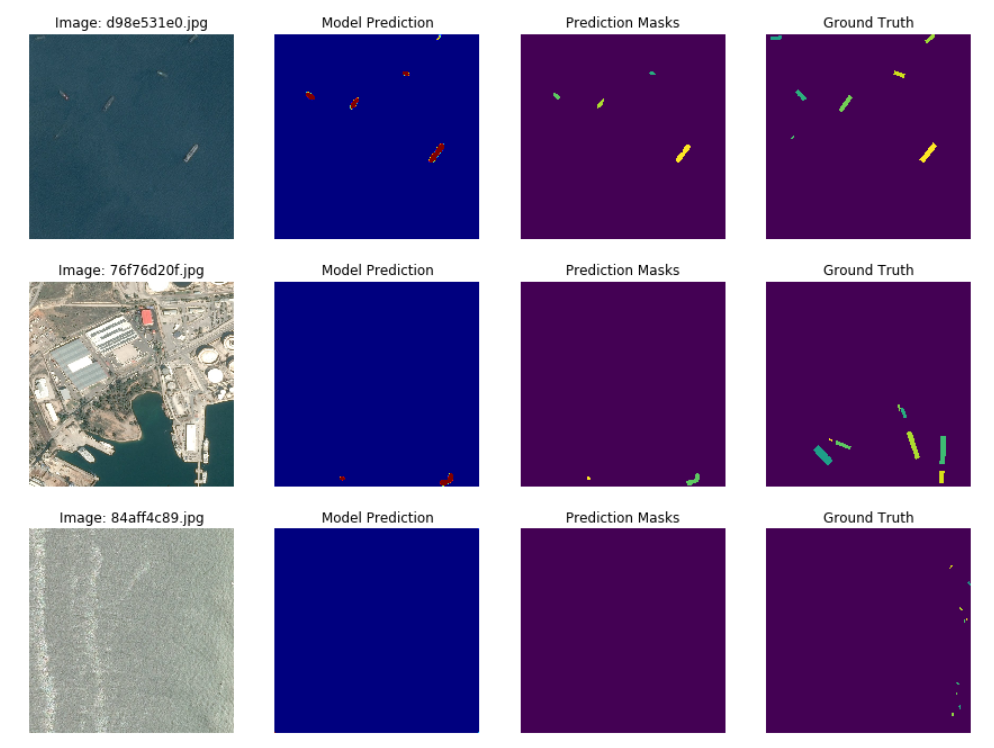

# Airbus Ship Detection Challenge

_This project is aimed to build a semantic segmentation model for [Airbus Ship Detection Challenge](https://www.kaggle.com/c/airbus-ship-detection/overview)_

**Used tools and notes:** 
 - Python,
 - tf.keras, 
 - U-net architecture for neural network, 
 - IoU Loss, Dice score.

**Author: Hanna Sholotiuk**

______

### HOW TO USE:
1. Create the virtual environment:

`python3 -m venv venv`

2. Activate the virtual environment

`source venv/bin/activate`

3. Install all the necessary packages:

`pip install -r requirements.txt`

4. Run the project:

 `python3 inference.py --input /path-to-images/`

______________________________________________

**Important to notice:**
If you want to train your own model, you need to download the Airbus Ship Detection Dataset (size ~ 32 GB).
__________________________________________________________

The **BASE_DIR** is the dataset folder with the following content:
 <pre>
 ├── train_v2
 │   ├── image.jpg
 │   └── ...
 ├── test_v2
 │   ├── image.jpg
 │   └── ...
 ├── train_ship_segmentations_v2.csv
 ├── sample_submission_v2.csv
 </pre>

________________________________
### Project Description

The project's **directory tree** has the structure below:
<pre>
 ├── md_images      # images for README.MD
 ├── predictions    # folder with model predictions
 ├── saved_model
 │   ├── seg_model.h5
 │   ├── fullres_model.h5
 │   └── seg_model_weights.best.hdf5
 ├── src
 │   ├── __init__.py
 │   ├── config.py
 │   ├── utils.py
 │   ├── train.py
 │   └── preprocessing.py
 ├── airbus-eda.ipynb
 ├── train.py        
 ├── inference.py 
 ├── requirements.txt
 └── README.md
</pre>

   #### Content description:
     1. src/ directory contains all losses (also custom metrics), preprocessing functions and configurations 
        that be used for this task.
       
     b. saved_models/ contains pretrained model and best weights.
  
     c. airbus-eda.ipynb contains the full pipeline of dataset EDA.
     
     d. inference.py is the main file for model testing. 
     
     e. train.py used for our model training.

________________________________________________

### The Development process includes:
- problem identifying: the main task highlighting and goals setting;
- research: dataset EDA, learning research papers, some tutorials or similar projects, resources analysis;
- experiments: trying different approaches and models, changing network architecture, parameters tuning; 
- project development: building the whole project, bugs fixing;
- training the model: trying to get the best dice score;
- result evaluation: testing and validating the model.

First of all, during the [EDA](airbus-eda.ipynb) a balanced dataset was created, it has the limit of 4000 images per each class (0-15 ships).
The reason of down-sampling is ~80% images with no ships in the original.

Airbus Ship Detection dataset. Full EDA process is available here: [[airbus-eda.ipynb]](airbus-eda.ipynb)

Besides, the dataset images was downscaled to 256x256 during the training process in order to improve memory and computational efficiency.
The model also was prepared for dealing with the original resolution 768x768, but due to memory and time limits wasn't trained and tested.

The data preprocessing pipeline is here: [[preprocessing.py]](src/preprocessing.py)

After training the entire model, **the dice score reaches ~0.85, the IoU ~0.75 after 3 training epochs**, but with bigger resolution and after more epochs it might be better.

The model training process is here: [[train.py]](train.py)

The functions for metrics evaluation are here: [[utils.py]](src/utils.py)

Link to the original Airbus Ship Detection Challenge & Dataset - [[https://www.kaggle.com/c/airbus-ship-detection](https://www.kaggle.com/c/airbus-ship-detection)].

_________________________________________________________

### Architecture:

 - Architecture: U-Net
 - Loss function: IoU
 - Metric: Dice score
 - Optimizer: Adam (lr=1e-3, decay=1e-6)
 - Learning scheduler: ReduceLROnPlateau(factor=0.5, patience=3)
 
__________________________________________________

### Visual results

 
You can also find some prediction results in [predictions/]('predictions/') folder.

_______________________________________________